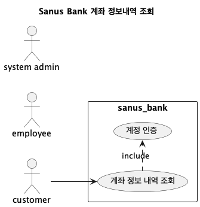
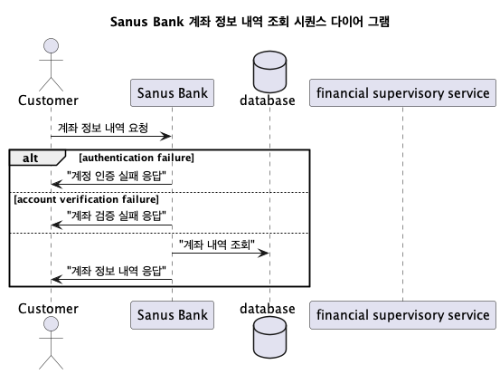
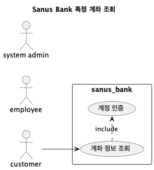
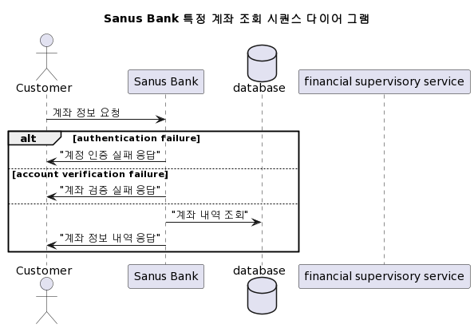
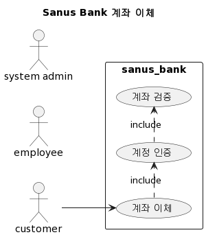
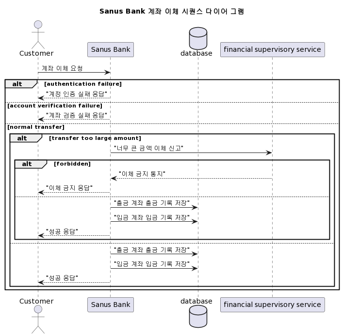
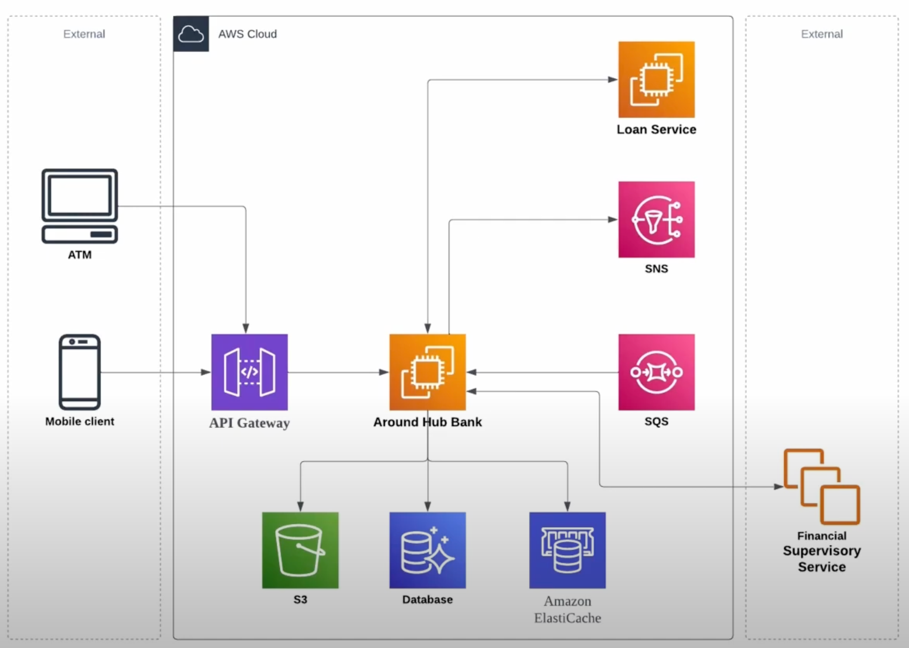
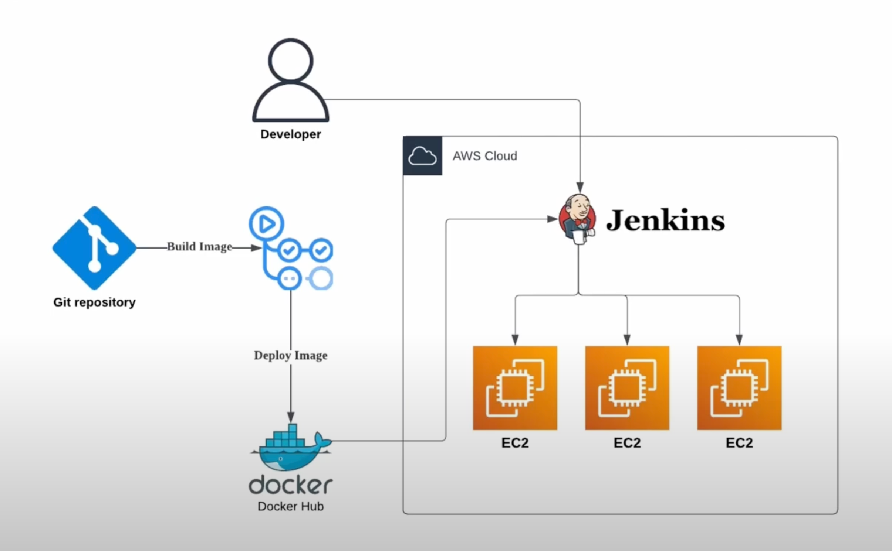

# Sanus Bank App


은행 앱 어플리케이션 

[](LICENSE)
[](CHANGELOG.md)

## 개발 환경

- SpringBoot: 3.1.2
- Jdk: 17
- DB: Docker(MariaDb)
- Spring Data JPA

### 선행 조건
- docker-compose.yml 빌드
  <pre>docker-compose up -d</pre>
- node 설치 (Mac)
  <pre>
  brew install node@18
  </pre>
- 윈도우에서 는 Node.js 홈페이지에서 다운받으면 됩니다.
___
## 1. 은행 시스템 개발 설계 하기
### 계좌 정보 내역 조회

#### UseCase



#### Sequence Diagram


#### Data Flow
* input - PathVariable
```json
{
  "accountToken": "계정 토큰(id)"
}
```
토큰값은 헤더값을 통하여 전달하여야 하지만 우선은 PathVariable로 전달 예정(추후 변경될 수도 있음)

* output - ResponseBody
```json
{
  "content" : [
    {"accountNumber": "string",
    "accountAmount": 0
    }
  ],
  "resultCode": "string",
  "resultMessage": "string"
}
```

#### REST API Specification
**Request**
- HTTP Method
- Endpoint
- Header
- Body
  - (Path Variable | Request Parameter | Request Body)
  - parameter type
  - parameter size
  - parameter description
- Curl

**Response**
- Header
- Body
  - parameter type
  - parameter size
  - parameter description
### 특정 계좌 정보 조회

#### UseCase


#### Sequence Diagram


#### Data Flow (거래 내역)
* input - PathVariable
```json
{
  "accountToken": "계정 토큰(id)",
  "accountNumber": "계좌 번호",
  "viewYearMonth": "조회 연월"
}
```

* output - ResponseBody
```json
{
  "content": {
    "accountNumber": "string",
    "accountType": "string",
    "accountName": "string",
    "accountAmount": 0,
    "depositAndWithdrawalHistory": [
      {
        "type": "deposit",
        "dawDate": "0000-00-00 00:00:00",
        "sender": "string",
        "remainAmount": 0
      }
    ]
  },
  "resultCode": "string",
  "resultMessage": "string"
}
```

#### Data Flow (계좌 상세)
* input - PathVariable

```json
{
  "accountToken": "계정 토큰(id)",
  "accountNumber": "계좌 번호"
}
```

* output - ResponseBody
```json
{
  "content": {
    "accountNumber": "string",
    "accountType": "string",
    "accountName": "string",
    "accountAmount": 0,
    "amountAvailableForWithdrawal": 0,
    "createDate": "string",
    "lastTransactionDate": "string",
    "branch": "string"
  },
  "resultCode": "string",
  "resultMessage": "string"
}
```
### 계좌 이체
#### UseCase


#### Sequence Diagram


#### Data Flow
* input - RequestBody

```json
{
  "requestAccountNumber": "string",
  "resultType": "string",
  "requestAmount": 0,
  "accountToken": "string",
  "targetAccountNumber": "string",
  "targetAmount": 0
}
```
* output - ResponseBody

```json
{
  "resultCode": "string",
  "resultMessage": "string"
}
```
---
## 2. 데이터베이스 스키마 설계
> 각 테이블 간 관계는 1:N 관계로 매핑 하여 설계 고려<br>
> 정규화를 진행 중복 데이터를 허용하지 않을거<br>
> 일부 쓰기 성능을 포기하고 읽기 성능을 개선하기 위해 역정규화

### 고객 (Customer)
| Field        | Type       | Description |
|--------------|------------|-------------|
| id (**pk**)  | integer    | 고객 아이디     |
| name         | string     | 이름         |
| grade        | string     | 등급         |
| age          | integer    | 나이         |
| email        | string     | 이메일        |
| organization | string     | 회사         |
| create_at    | timestamp  | 생성일자      |
| updated_at   | timestamp  | 수정일자      |

### 계좌 (Account)
| Field                | Type      | Description |
|----------------------|-----------|-------------|
| id (**pk** )         | integer, increment | 인덱스         |
| number               | string    | 계좌번호        |
| type                 | string    | 계좌타입        |
| balance              | integer   | 잔액          |
| password             | string    | 패스워드        |
| employee_id          | integer   | 담당 직원 아이디   |
| branch_id            | integer   | 담당 지점 아이디   |
| customer_id (**fk**) | integer   | 고객 아이디      |
| create_at            | timestamp | 생성일자        |
| updated_at           | timestamp | 수정일자        |

### 지점 (Branch)
| Field        | Type       | Description |
|--------------|------------|-------------|
| id (**pk** ) | integer    | 지점 아이디  |
| name         | string     | 지점 명     |
| address      | string     | 주소        |

### 직원 (Employee)
| Field             | Type       | Description     |
|-------------------|------------|-----------------|
| id (**pk**)       | integer    | 직원 아이디      |
| name              | string     | 직원 이름        |
| branch_id (**fk**) | integer    | 소속 지점 아이디  |

### 거래내역 (Transaction)

| Field                     | Type            | Description         |
|---------------------------|-----------------|---------------------|
| id (**pk**)               | integer, increment | 인덱스              |
| balance                   | integer         | 금액               |
| type                      | string(enum)    | ex.입금,출금,이체 등 |
| balance_after_transaction | integer         | 거래 처리 후 금액   |
| account_number (**fk**)   | string          | -                   |
___
## 3. 마이크로 아키텍쳐 설계
#### 마이크로 서비스 간 관계


#### CI/CD 구성


___
## 4. REST 규칙 
* 명사를 사용 하여 경로를 표현
* 소문자를 사용
* 언더바 대신 하이픈을 사용
* 마지막에 슬래시를 사용하지 않아야 함
* 파일 확장자는 사용하지 않음 (확장자 처리는 Content-Type, Accept 헤더 등을 사용하여 표현)
___
